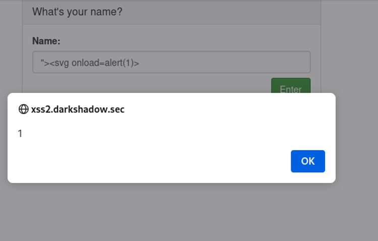

Lab 2: Reflected XSS (Attribute Context)
Description
In this lab, the user input is reflected inside an HTML attribute. A breakout payload is required to close the attribute and execute a script.

Payload Used
```HTML
"><svg onload=alert(1)>
```
Context

Vulnerability Location: HTML Attribute Context.

Proof of Concept

