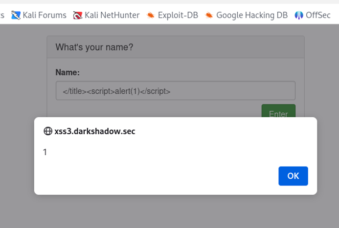

# Lab 3: Reflected XSS (Title Tag Context)
# Description
The vulnerability exists because the input is reflected within the <title> tag context. By closing the title tag, a script can be injected and executed.

# Payload Used
``` HTML
</title><script>alert(1)</script>
```
# Context
Vulnerability Location: Title Tag Context.

# Proof of Concept

