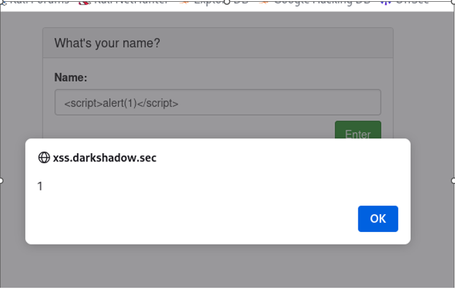

# DVWA Cross-Site Scripting (XSS) Labs

## Lab 1: Reflected XSS (Low)

### Description
The application fails to sanitize user input before reflecting it back into the HTML body. [cite_start]This allows for the execution of arbitrary JavaScript[cite: 13, 14].

### Payload Used
```html
<script>alert(1)</script>
```
Context

Vulnerability Location: HTML Body Context.

Proof of Concept

