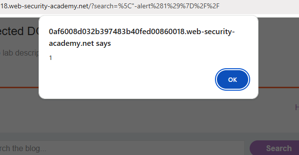

# Reflected XSS - JavaScript string with angle brackets and double quotes HTML-encoded and single quotes escaped

### Description
This lab demonstrates a bypass where traditional XSS characters are encoded or escaped. By using a backslash to escape the escape character itself, it is possible to break out of the JavaScript string literal and execute arbitrary code.

### Vulnerable Parameter
* **Parameter:** `search`
* **Vulnerable URL:** `/?search=\"-alert(1)}//`

### Payload Used
```javascript
\"-alert(1)}//
```
Steps to Reproduce
1. Enter the payload \"-alert(1)}// into the search bar.

2. The backslash bypasses the server's escaping logic.

3. The script breaks out of the var or function container.

4. The alert(1) executes, and // neutralizes the remaining broken code.

Proof of Concept

