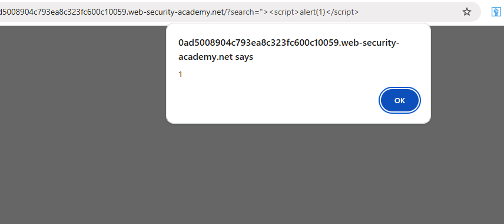

# Reflected XSS - Lab 2 (Attribute Breakout)

### Description
This lab demonstrates a **Reflected Cross-Site Scripting (XSS)** vulnerability. The vulnerability exists because the application reflects user input from the `search` parameter into an HTML attribute without proper encoding, allowing an attacker to "break out" and execute JavaScript.

### Vulnerable Parameter
* **Field:** Search Input Box
* **Parameter:** `search`
* **Vulnerable URL:** `/?search="><script>alert(1)</script>`

### Payload Used
```html
"><script>alert(1)</script>
### Steps to Reproduce ```
Navigate to the home page of the vulnerable application.

In the search bar, enter the following breakout payload: "><script>alert(1)</script>.

The "> characters close the current HTML attribute and tag (e.g., <input value="...">).

Click the Search button.

The browser executes the injected <script> tag, and an alert box with "1" appears.

### Proof of Concept



