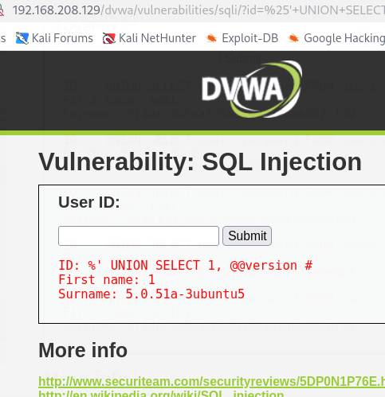

# UNION-Based SQL Injection (DVWA)

This repository contains a breakdown of a UNION-based SQL Injection vulnerability. This specific payload is designed to bypass standard input filters to extract database metadata, such as the version number.

## Payload
```sql
%' UNION SELECT 1, @@VERSION #
```

## How It Works


The payload works by breaking the original SQL query and appending a secondary query to it.

| Component | Function |
| :--- | :--- |
| **`%'`** | The `%` acts as a wildcard for the search. The single quote `'` is the **delimiter**; it tells the database that the developer's intended input string has ended. |
| **`UNION`** | This operator combines the results of the original query with the results of our injected query. |
| **`SELECT 1, @@VERSION`** | This is the injected query. Since the original application expects two columns (`first_name` and `last_name`), we provide two values: a placeholder (`1`) and the database system variable (`@@VERSION`). |
| **`#`** | The hash symbol is a **comment** in MySQL. It tells the server to ignore the rest of the original code (like the closing quote), preventing a syntax error. |

## Expected Output
When executed in a vulnerable field, the application will display:
* **First Name:** 1
* **Surname:** [The Database Version, e.g., 5.0.51a-3ubuntu5]

---


proof of concept

