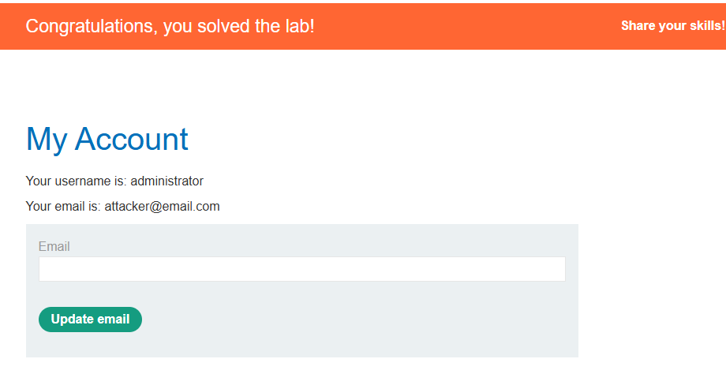

## 3. Authentication Bypass (Login Override)

This exploit demonstrates how a tautology can be used to bypass a login security check without knowing a valid password. By manipulating the logic of the `WHERE` clause, an attacker can log in as the first user in the database—typically the **administrator**.

### Payload
Entered into the `username` field:
```sql
' OR 1=1--
```
### The Logic Breakdown
In a standard login scenario, the database query looks like this:
`SELECT * FROM users WHERE username = 'input_user' AND password = 'input_password'`

By entering the payload into the username field, the query is rewritten as:
`SELECT * FROM users WHERE username = '' OR 1=1--' AND password = '...'`

### Why This Grants Access
*   **The Break (`'`):** This closes the empty string for the username.
*   **The Tautology (`OR 1=1`):** This creates a condition that is always true. In SQL, if any part of an `OR` statement is true, the entire condition is met for that row.
*   **The Comment (`--`):** This is the "eraser". It tells the database to ignore the rest of the query, effectively deleting the `AND password = '...'` check. 
*   **Result:** The database returns the first record where the condition is true. Since most databases list the administrative account first, the attacker is logged in as `administrator`.

### Evidence
As seen in **image, the payload successfully bypassed the authentication wall, granting access to the `administrator` account dashboard.


proof of concept

