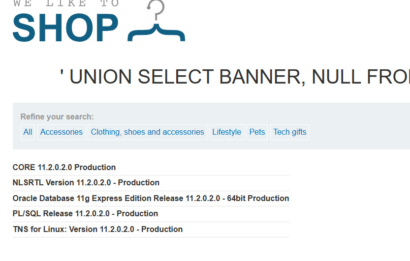

## 4. Oracle Database Fingerprinting (UNION-Based)

In this scenario, the goal is to identify the specific version of the database. Since Oracle uses unique system table names and specific syntax requirements, this payload confirms that the back-end is running Oracle software.

### Payload
```sql
' UNION SELECT BANNER, NULL FROM v$version--
```

### Detailed Breakdown

*   **The Escape (`'`):** The single quote breaks out of the original application's SQL query string.
*   **The `UNION` Operator:** This is used to combine the results of the original product query with our custom query.
*   **Targeting Oracle (`v$version`):** Unlike MySQL (which uses `@@version`), Oracle stores its version information in a specific system table called `v$version`.
*   **The `BANNER` Column:** This is the specific column within the `v$version` table that contains the descriptive text of the database version (e.g., "Oracle Database 11g Express Edition").
*   **The `NULL` Placeholder:** SQL `UNION` operations require both queries to have the exact same number of columns. Since the original product search likely returns two columns (e.g., Name and Description), we use `NULL` to fill the second column requirement.
*   **The Comment (`--`):** This "erases" any remaining characters from the original code (like the closing quote), preventing a syntax error that would otherwise block the results from displaying.

### Results and Evidence
By executing this payload, the application merges the system information into the product list. As seen in **image**, the screen displays the Oracle version strings (e.g., *CORE 11.2.0.2.0 Production*), proving successful exploitation.

---
proof of concept

