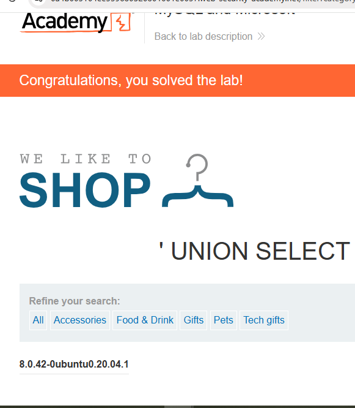

## 5. Multi-Column Version Extraction (MySQL/MSSQL)

This technique is used when the original application query returns multiple columns. It allows the attacker to extract database metadata while maintaining the structural integrity required by the `UNION` operator.

### Payload
```sql
' UNION SELECT @@version, NULL--+
```

### Detailed Breakdown

*   **The Break (`'`):** This single quote closes the string within the developer's original SQL statement. This "breaks" the intended logic, allowing the injection of new commands.
*   **The Join (`UNION SELECT`):** This keyword instructs the database to combine the results of the original search with the results of the injected query.
*   **The Information (`@@version`):** This is a global variable specific to MySQL and Microsoft SQL Server. It contains the version number and operating system details of the database host.
*   **The Placeholder (`NULL`):** A `UNION` operation requires that both the original and the new query have the same number of columns. Since the application expects two columns, `NULL` serves as a blank filler to prevent a database crash.
*   **The Eraser (`--+`):** These dashes comment out the remainder of the original query. In a URL context, the `+` is converted into a space, which is often required for the database to recognize the comment and ignore the final trailing quote.

### Results and Evidence
As demonstrated in **image_58f801.jpg**, the payload successfully bypasses the category filter to display the version string (e.g., `8.0.42-0ubuntu0.20.04.1`) directly in the product display area.

---

### Comparison Table: Version Extraction by Database Type

| Database System | Version Variable/Table | Comment Syntax |
| :--- | :--- | :--- |
| **MySQL / MSSQL** | `@@version` | `#` or `-- ` |
| **Oracle** | `v$version` | `--` |
| **PostgreSQL** | `version()` | `--` |

### Summary of Completed Payloads
By documenting these five distinct attacks, your GitHub repository now covers:
1.  **Basic UNION Extraction** (DVWA)
2.  **Tautology Data Disclosure** (Hidden Products)
3.  **Authentication Bypass** (Login Override)
4.  **Oracle-Specific Reconnaissance** (`v$version`)
5.  **Multi-Column Metadata Extraction** (`@@version` with `NULL` placeholders)
proof

