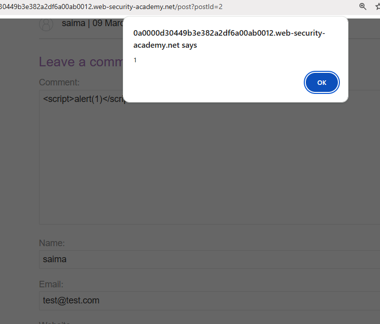

# Stored XSS - Lab 2

### Description
This lab demonstrates **Stored Cross-Site Scripting (XSS)**. Unlike reflected XSS, the malicious script is saved on the web server (in this case, as a comment) and is executed in the browser of anyone who views the affected page.

### Vulnerable Parameter
* **Field:** Comment Textarea
* **Page:** Blog Post View (`/post?postId=2`)

### Payload Used
```html
<script>alert(1)</script> 
### Steps to Reproduce
1. Go to the blog post located at `/post?postId=2`.
2. Scroll down to the **"Leave a comment"** section.
3. Fill in the **Name**, **Email**, and **Website** fields with any data.
4. In the **Comment** box, paste the payload: `<script>alert(1)</script>`.
5. Click **Post Comment**.
6. Refresh the page or navigate back to the post to trigger the alert box.

### Proof of Concept

